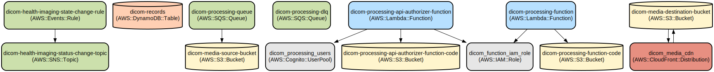

# DICOM Medical Image Processing and Viewing Platform

A secure, cloud-based medical imaging platform that enables healthcare professionals to process, view, and analyze DICOM images with advanced visualization tools and automated processing capabilities.

This platform combines a modern React-based frontend viewer with AWS serverless backend services to provide a complete solution for medical image management. The system features role-based access control, real-time image processing, and a feature-rich DICOM viewer with tools for measurement, annotation, and window/level adjustments.

Key features include:
- Advanced DICOM viewer with pan, zoom, rotate, and window/level controls
- Secure authentication and authorization using AWS Cognito
- Automated DICOM image processing using AWS Lambda
- Scalable image storage with S3 and CloudFront CDN integration
- Real-time notifications for image processing status
- Role-based access control for different types of healthcare professionals

## Repository Structure
```
.
├── src/                          # Source code directory
│   ├── frontend/                 # React frontend application
│   │   ├── src/                 # Frontend source files
│   │   │   ├── components/      # Reusable React components including DICOM viewer
│   │   │   ├── contexts/        # React context providers for auth state
│   │   │   ├── pages/          # Page components for routing
│   │   │   └── types/          # TypeScript type definitions
│   └── lambda-functions/        # AWS Lambda function handlers
│       ├── api_authorizer.py    # Cognito JWT token verification
│       └── dicom_processing.py  # DICOM image processing logic
└── terraform/                   # Infrastructure as Code
    ├── modules/                 # Reusable Terraform modules
    │   ├── cognito/            # User authentication configuration
    │   ├── lambda/             # Lambda function configuration
    │   ├── s3/                 # Storage bucket configuration
    │   └── cloudfront/         # CDN distribution configuration
    └── main.tf                 # Main Terraform configuration
```

## Usage Instructions
### Prerequisites
- Node.js >= 20.x
- Python >= 3.12
- AWS CLI configured with appropriate credentials
- Terraform >= 1.0
- Git

### Installation

1. Clone the repository:
```bash
git clone <repository-url>
cd dicom-processing-platform
```

2. Install frontend dependencies:
```bash
cd src/frontend
npm install
```

3. Deploy infrastructure:
```bash
cd terraform
terraform init
terraform plan
terraform apply
```

4. Configure environment variables:
```bash
cp .env.example .env
# Edit .env with your AWS configuration
```

### Quick Start

1. Start the frontend development server:
```bash
cd src/frontend
npm run dev
```

2. Access the application at `http://localhost:5173`

3. Log in using the provided credentials or sign up for a new account

### More Detailed Examples

**Viewing DICOM Images:**
```typescript
// Using the DicomViewer component
import { DicomViewer } from './components/DicomViewer';

function ViewerPage() {
  return <DicomViewer studyId="S001" />;
}
```

**Processing DICOM Files:**
```python
# Upload DICOM file to S3
aws s3 cp image.dcm s3://dicom-media-source-bucket/images/

# The system will automatically process the file and notify via SNS
```

### Troubleshooting

**Common Issues:**

1. Authentication Errors
- Error: "Invalid token"
  - Check if Cognito user pool is properly configured
  - Verify environment variables for USER_POOL_ID and APP_CLIENT_ID
  - Clear browser cache and try logging in again

2. Image Processing Failures
- Check CloudWatch logs for Lambda function errors
- Verify S3 bucket permissions
- Check SQS queue for failed messages in DLQ

3. Viewer Performance Issues
- Enable browser developer tools
- Check network tab for image loading times
- Verify CloudFront distribution is properly configured

## Data Flow
The platform processes DICOM images through a series of AWS services, from upload to viewing.

```ascii
Upload → S3 → SQS → Lambda → Medical Imaging Service → S3 → CloudFront → Viewer
   │       │      │         │                           │
   │       │      │         └─── DynamoDB ─────────────┘
   │       │      └─── SNS Notifications
   └───────┴──── EventBridge Rules
```

Key component interactions:
1. Files uploaded to S3 trigger SQS messages
2. Lambda processes images using AWS Medical Imaging service
3. Processed images are stored in S3 and served via CloudFront
4. DynamoDB stores metadata and processing status
5. SNS sends notifications on processing completion
6. Frontend viewer fetches images through CloudFront
7. API Gateway with Lambda authorizer secures all API endpoints

## Infrastructure



### Lambda Functions
- `dicom-processing-function`: Processes DICOM images
- `dicom-processing-api-authorizer-function`: Handles API authentication

### Storage
- S3 Buckets:
  - `dicom-media-source-bucket`: Raw DICOM files
  - `dicom-media-destination-bucket`: Processed images
  - `dicom-processing-function-code`: Lambda function code

### Authentication
- Cognito User Pool: `dicom_processing_users`
  - Email verification enabled
  - Password policies configured
  - OAuth flows supported

### Queuing and Notifications
- SQS Queue: `dicom-processing-queue`
  - Dead Letter Queue enabled
  - 3 maximum receive count
- SNS Topic: `dicom-health-imaging-status-change-topic`

### Content Delivery
- CloudFront Distribution
  - Origin Access Control
  - CORS configured
  - Custom cache behaviors

## Deployment

1. Prerequisites:
- AWS account with appropriate permissions
- Terraform installed
- AWS CLI configured

2. Infrastructure Deployment:
```bash
cd terraform
terraform init
terraform plan
terraform apply
```

3. Frontend Deployment:
```bash
cd src/frontend
npm run build
aws s3 sync dist/ s3://your-frontend-bucket
```

4. Verify Deployment:
- Check AWS Console for resource creation
- Verify CloudFront distribution is enabled
- Test authentication flow
- Monitor CloudWatch logs for errors